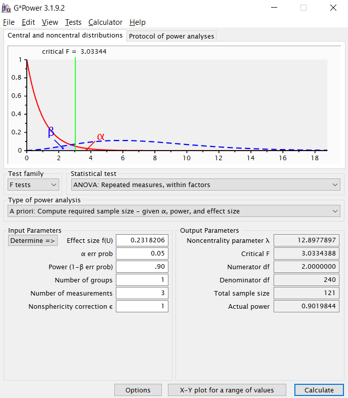

<!-- Replication reports should all use this template to standardize reporting across projects.  These reports will be public supplementary materials that accompany the summary report(s) of the aggregate results. -->

##Introduction

<!-- [No abstract is needed.]  Each replication project will have a straightforward, no frills report of the study and results.  These reports will be publicly available as supplementary material for the aggregate report(s) of the project as a whole.  Also, to maximize project integrity, the intro and methods will be written and critiqued in advance of data collection.  Introductions can be just 1-2 paragraphs clarifying the main idea of the original study, the target finding for replication, and any other essential information.  It will NOT have a literature review -- that is in the original publication. You can write both the introduction and the methods in past tense.   -->

The original paper can be found here: 

##Methods

###Power Analysis

<!-- Original effect size, power analysis for samples to achieve 80%, 90%, 95% power to detect that effect size.  Considerations of feasibility for selecting planned sample size. -->

In the original paper, Sloman and Rabb report an $\eta^2$ value of 0.051. Using G*Power, we determine that the equivalent effect size for a repeated measures ANOVA is 0.2318. Using this effect size, we determine that the necessary sample size at .80, .90, and .95 power standards are 93, 121, and 147 respectively.



###Planned Sample

<!-- Planned sample size and/or termination rule, sampling frame, known demographics if any, preselection rules if any. -->

In the original study, Sloman and Rabb initially recruited 146 participants on Amazon Mechanical Turk, but found that 40 failed an attention check, a 27.39% failure rate. Assuming the same proportion of participants fail the attention checks, we would need to recruit 129, 167, or 203 participants at the .80, .90, and .95 power standards respectively to achieve the desired sample size.

We will recruit 167 participants from Amazon Mechanical Turk. With this sample, in anticipation of 27.39% of the subjects not passing the attention check, we will have 121 remaining subjects, meeting the .90 power standard.


###Materials

<!-- All materials - can quote directly from original article - just put the text in quotations and note that this was followed precisely.  Or, quote directly and just point out exceptions to what was described in the original article. -->

This replication reuses the open materials on the original article's OSF posting, which can be found here: https://osf.io/24kvu/

###Procedure	

<!-- Can quote directly from original article - just put the text in quotations and note that this was followed precisely.  Or, quote directly and just point out exceptions to what was described in the original article. -->

From the original article:

> "One hundred forty-six U.S. residents (56% female, 44% male; mean age = 33.9 years) were recruited using Amazon's Mechanical Turk, screened for participation in the previous experiment, and given a small payment. Sample size was chosen to satisfy counterbalancing schemes and was in keeping with related prior research. Participants received the same instructions as in Experiment 1, except for one modification: The cover story claimed that the study concerned recent scientific discoveries "made by DARPA, the research agency of the U.S. military," an entity chosen for its power to keep scientific knowledge absolutely secret. Participants rated their understanding of six fictional natural phenomena (an example is shown in Table 1). Each participant read two descriptions of phenomena that had been  thoroughly explained by the discovering scientists in a published article (public CK condition); two descriptions of different phenomena that had not yet been explained but that had been described in a published article by the scientists who discovered it (public no-CK condition); and two descriptions of still other phenomena that had been thoroughly explained but only in classified documents (secret CK condition). The descriptions contained no causal or explanatory information. Items were counterbalanced across conditions and across two random presentation orders. For reasons unrelated to our current purposes, each participant then generated a step-by-step causal explanation for two of the phenomena and rerated understanding of the two items. They also answered a question incorporated as an attention check and were asked if they had consulted external Web sites during the experiment."

Unlike the original study, we use a different randomization scheme. The order of the conditions (public CK, public no-CK, secret CK) were still counterbalanced, but rather than 2 random presentation orders of the phenomena, we use a true random presentation order of the 6 phenomenas using a Fisher-Yates Shuffle. That is, the $N$th question that a participant saw was the $N$th phenomena after shuffling the phenomena, and language from the first condition was shown when $N=1$ or $N=2$, the second condition shown when $N=3$ or $N=4$, and the final condition shown $N=5$ or $N=6$.

The participants then completed the same attention check and external website question used in the original paper.

###Analysis Plan

<!-- Can also quote directly, though it is less often spelled out effectively for an analysis strategy section.  The key is to report an analysis strategy that is as close to the original - data cleaning rules, data exclusion rules, covariates, etc. - as possible.   -->

<!-- **Clarify key analysis of interest here**  You can also pre-specify additional analyses you plan to do. -->

To replicate the original paper, our primary analysis we will use a repeated measures ANOVA on the log-transformed ratings of understanding to try to uncover the main effect of knowledge condition (public CK, public non-CK, and secret CK) on reported understanding. We also try modeling the data with a mixed effects linear model on the log-transformed ratings of understanding. Finally, we perform both the repeated emasures ANOVA and the mixed effects model on the absolute ratings of understanding, since there does not appear to be a reason to use the log-transformed ratings of understanding in the construct we are testing.

To test for any ordering effects (e.g.potentially due to fatigue or learning), we will see if there is a linear order effect based on the presentation order of the phenomena.


###Differences from Original Study

<!-- Explicitly describe known differences in sample, setting, procedure, and analysis plan from original study.  The goal, of course, is to minimize those differences, but differences will inevitably occur.  Also, note whether such differences are anticipated to make a difference based on claims in the original article or subsequent published research on the conditions for obtaining the effect. -->

Key differences in this replication are:
-A larger sample consisting of 167 participants before exclusions.
-A different counterbalancing scheme. Counterbalancing still exists across conditions (for 6 permutations of presentation order of the 3 conditions), but the order of the phenomena is a true random presentation (as opposed to randomly picked from a limited set of sequences for a pseudo-random order)
-Additional analyses: in addition to replicating the model in the original paper using log-transformed data, we will run the same model on the absolute data and also additionally run a mixed effect model.

### Methods Addendum (Post Data Collection)

You can comment this section out prior to final report with data collection.

#### Actual Sample
  Sample size, demographics, data exclusions based on rules spelled out in analysis plan

#### Differences from pre-data collection methods plan
  Any differences from what was described as the original plan, or “none”.


##Results


### Data preparation

Data preparation following the analysis plan.
	
```{r include=FALSE}
#Load in relevant libraries and functions
library(tidyverse)
library(stringr)
library(lme4)
library(ez)
```


```{r include=F}
####Setting some parameters
NUM_CONDITIONS = 3
NUM_PHENOMENA = 6
NUM_SCENARIOS_PER_SUBJECT = 6

####Import data
df_raw <- read_csv(file = "../data/pilotB.csv")
instructions_colnum <- which(colnames(df_raw) == "Instructions")
problem_text <- df_raw[1,(instructions_colnum+1):(instructions_colnum+(NUM_CONDITIONS * NUM_PHENOMENA * NUM_SCENARIOS_PER_SUBJECT))]

####Update column names using the question text

#For loop to determine the new name
for(i in 1:(NUM_CONDITIONS * NUM_PHENOMENA * NUM_SCENARIOS_PER_SUBJECT)){
  #Extract which scenario number (as seen by the participant) this particular question text was for
  scenario_num <- as.integer((i-1)/18) + 1
  
  #Extract which condition this particular question text contained
  condition <- if((i-1)%%18 < 6) "secret_cok" else if((i-1)%%18 < 12) "public_cok" else "public_noncok"
  
  #Extract which phenomenon this particular question text contained
  phenomenon <- str_extract(as.character(problem_text[1,i]),"(rock)|(fish)|(ice)|(weather)|(sand)|(wood)")
  
  #Store all of this information
  problem_text[2,i] <- scenario_num
  problem_text[3,i] <- condition # e.g. "public_cok"
  problem_text[4,i] <- if(phenomenon == "rock") "glowing_rock" else
    if(phenomenon == "fish") "flying_fish" else 
    if(phenomenon == "ice") "warm_ice" else
    if(phenomenon == "weather") "liquid_helium" else
    if(phenomenon == "sand") "self_forming_glass" else "reflective_smoke"
  problem_text[5,i] <- paste(problem_text[2,i], problem_text[3,i], problem_text[4,i], sep="~")
}

#Update column name in df_raw
names(df_raw)[(instructions_colnum+1):(instructions_colnum+(NUM_CONDITIONS * NUM_PHENOMENA * NUM_SCENARIOS_PER_SUBJECT))] <- problem_text[5,]

####Remove question text row and convert raw data into long form
df_long <- df_raw %>%
  filter(row_number()!=1) %>% #Remove the secondary headers
  mutate(subject_id = 1:n()) %>% #Add subject IDs
  gather("order:condition~phenomenon", "rating", `1~secret_cok~glowing_rock`:`6~public_noncok~reflective_smoke`, na.rm = TRUE) %>%
  separate("order:condition~phenomenon", 
           into = c("order","condition", "phenomenon"), 
           sep = "~")  %>%
  mutate_each(funs(as.integer(ifelse(is.na(.),0,.), na.rm=TRUE)), contains("Manipulation Check")) %>% #Change all manipulation check cells to integers
  mutate(`Attention Check` = as.integer(ifelse(is.na(`Attention Check`),0,`Attention Check`), na.rm=TRUE)) %>% #Change all attention check cells to integers
  mutate(rating = as.integer(rating, na.rm=TRUE)) #Change all ratings to integers

#### Data exclusion / filtering
df_long <- df_long %>%
  filter(`Attention Check` == 16) %>% #Must pass attention check
  mutate("Manipulation Check Errors" = (1 - `Manipulation Check_1`) + (1 - `Manipulation Check_2`) + #False negatives
           (1 - `Manipulation Check_3`) + (1 - `Manipulation Check_4`) + #False negatives
           (1 - `Manipulation Check_5`) + (1 - `Manipulation Check_6`) + #False negatives
           `Manipulation Check_7` + `Manipulation Check_8` + `Manipulation Check_9`) %>% #False positives
  filter(`Manipulation Check Errors` <= Inf) # This line will be changed to 1 when including the manipulation check 

df_long
```

### Confirmatory analysis

The analyses as specified in the analysis plan.  
##This recreates Table 2 from the original paper.
```{r}
#Recreate Table 2 from original paper
df_long %>% 
  group_by(condition) %>%
  summarise(mean = mean(rating), sd = sd(rating))

```

```{r}
#Original paper averages within condition and subject
df_grouped_by_subject_and_cond <- df_long %>%
  group_by(subject_id, condition) %>%
  summarise(mean = mean(rating)) %>%
  mutate(Log_Understanding = log(mean))
df_grouped_by_subject_and_cond
```

##This is the primary analysis, replicating the repeated measures ANOVA used in the original paper.
```{r}
#Repeated Measures Anova used in original paper: repeated measures ANOVA, log transformed means
aov_logs <- ezANOVA(data = df_grouped_by_subject_and_cond, dv = Log_Understanding, wid = subject_id, within = condition, detailed=TRUE)
aov_logs
```

##This replciates the paired comparisons between conditions used in the original paper.
```{r}
#Original paper also performed a t-test between the conditions' log-transformed means
public_cok <- df_grouped_by_subject_and_cond %>%
  filter(condition == "public_cok")

public_noncok <- df_grouped_by_subject_and_cond %>%
  filter(condition == "public_noncok")

secret_cok <- df_grouped_by_subject_and_cond %>%
  filter(condition == "secret_cok")

t.test(as.matrix(public_noncok[,"Log_Understanding"]), as.matrix(public_cok[,"Log_Understanding"]), var.equal = TRUE, paired=TRUE)
t.test(as.matrix(secret_cok[,"Log_Understanding"]), as.matrix(public_cok[,"Log_Understanding"]), var.equal = TRUE, paired=TRUE)
t.test(as.matrix(public_noncok[,"Log_Understanding"]), as.matrix(secret_cok[,"Log_Understanding"]), var.equal = TRUE, paired=TRUE)

```

*Side-by-side graph with original graph is ideal here*

###Exploratory analyses (analyses not in the original paper)

##Mixed effects model with log transformed values

```{r}
df_long_ME <- df_long %>%
  mutate(Log_Understanding = log(rating))

#Mixed Effects Model with log transformed values, without averaging within condition
MEModel_logs <- lmer(Log_Understanding ~ condition + (1 | subject_id) + (1 | phenomenon), data=df_long_ME) #Contains main effect of condition with random effects of subjects and phenomenon
anova(MEModel_logs) 
summary(MEModel_logs)
```

##Tests ordering effects on log-transformed values
```{r}
#Additionally considers order effects
MEModel_logs_ordered <- lmer(Log_Understanding ~ condition + (1 | subject_id) + (1 | phenomenon) + order, data=df_long_ME)
anova(MEModel_logs_ordered) 
summary(MEModel_logs_ordered)

anova(MEModel_logs, MEModel_logs_ordered)
```

##We try the same analyses on values without log transformation

#Repeated measures ANOVA
```{r}
#Repeated Measures Anova used in original paper: repeated measures ANOVA, absolute means
aov_abs <- ezANOVA(data = df_grouped_by_subject_and_cond, dv = mean, wid = subject_id, within = condition, detailed=TRUE)
aov_abs
```

#Paired comparisons
```{r}
#Paired comparison t-tests between the conditions absolute means
t.test(as.matrix(public_noncok[,"mean"]), as.matrix(public_cok[,"mean"]), var.equal = TRUE, paired=TRUE)
t.test(as.matrix(secret_cok[,"mean"]), as.matrix(public_cok[,"mean"]), var.equal = TRUE, paired=TRUE)
t.test(as.matrix(public_noncok[,"mean"]), as.matrix(secret_cok[,"mean"]), var.equal = TRUE, paired=TRUE)

```

#Mixed effects models
```{r}
#Mixed Effects Model with log transformed values, without averaging within condition
MEModel_abs <- lmer(rating ~ condition + (1 | subject_id) + (1 | phenomenon), data=df_long_ME) #Contains main effect of condition with random effects of subjects and phenomenon
anova(MEModel_abs) 
summary(MEModel_abs)
```

#Ordering effects
```{r}
#Additionally considers order effects
MEModel_abs_ordered <- lmer(rating ~ condition + (1 | subject_id) + (1 | phenomenon) + order, data=df_long_ME)
anova(MEModel_abs_ordered) 
summary(MEModel_abs_ordered)

anova(MEModel_abs, MEModel_abs_ordered)
```

We also collected demographic data (Age, Gender, Race) and can explore whether or not those interact with the effects we find.

We also used an additional manipulation check not in the original paper where participants are asked to select the phenomena that they read about out of a list of the 6 phenomena presented and an additional 3 unseen phenomena. However, a pilot of the experiment produced <50% success rate, suggesting that perhaps the memory demands recalling the phenomena are too high. In addition to performing the above analyses using only the exclusions from the original paper, we will also perform exploratory analyses excluding any participant who has more than 1 error (false positive or false negative) in identifying the different fictitious phenomena used in the study. The exploratory analyses will also use repeated measure ANOVAs and a mixed effects model.

## Discussion

### Summary of Replication Attempt

Open the discussion section with a paragraph summarizing the primary result from the confirmatory analysis and the assessment of whether it replicated, partially replicated, or failed to replicate the original result.

### Commentary

Add open-ended commentary (if any) reflecting (a) insights from follow-up exploratory analysis, (b) assessment of the meaning of the replication (or not) - e.g., for a failure to replicate, are the differences between original and present study ones that definitely, plausibly, or are unlikely to have been moderators of the result, and (c) discussion of any objections or challenges raised by the current and original authors about the replication attempt.  None of these need to be long.
