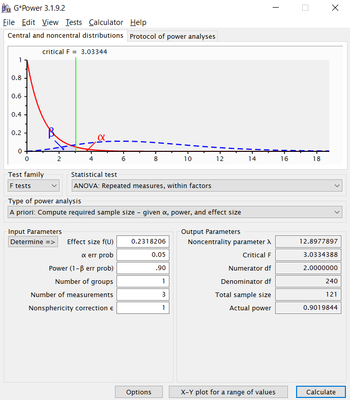

<!-- Replication reports should all use this template to standardize reporting across projects.  These reports will be public supplementary materials that accompany the summary report(s) of the aggregate results. -->

##Introduction

<!-- [No abstract is needed.]  Each replication project will have a straightforward, no frills report of the study and results.  These reports will be publicly available as supplementary material for the aggregate report(s) of the project as a whole.  Also, to maximize project integrity, the intro and methods will be written and critiqued in advance of data collection.  Introductions can be just 1-2 paragraphs clarifying the main idea of the original study, the target finding for replication, and any other essential information.  It will NOT have a literature review -- that is in the original publication. You can write both the introduction and the methods in past tense.   -->

The community of knowledge hypothesis suggests that individuals take cognitive credit for other people's knowledge despite not possessing themselves the knowledge for which they take credit. This would cause them to report having deeper understanding of various phenomena than they actually do. Sloman & Rabb (2016) further explored this hypothesis in their Experiment 2 by testing a variation where individuals are told that there exists some communal knowledge about a phenomenon that they do not have access to. They called this the "secret community of knowledge," and they believe that the extent to which information in the secret community of knowledge elevates people's perceived personal understanding of a phenomenon would be lower than the extent to which information in a public community of knowledge elevates that perception.

The community of knowledge hypothesis is important because of the role of communities in human learning and activity. Given the wealth of knowledge that has been accumulated and document over the course of human history, no one person can possibly understand all predecessing information even within specific domains. If the community of knowledge effect exists, it should encourage people to document and share the knowledge they possess. These contributions to a shared intellect will enable others to further push the frontiers of knowledge.

The original paper can be found here: http://journals.sagepub.com.laneproxy.stanford.edu/doi/full/10.1177/0956797616662271

##Methods

###Link to experiment

The experiment can be found here: https://stanforduniversity.qualtrics.com/jfe/form/SV_1Ajw7waXIYJJtI1


###Power Analysis

<!-- Original effect size, power analysis for samples to achieve 80%, 90%, 95% power to detect that effect size.  Considerations of feasibility for selecting planned sample size. -->

In the original paper, Sloman and Rabb report an $\eta^2$ value of 0.051. Using G*Power, we determine that the equivalent effect size for a repeated measures ANOVA is 0.2318. Using this effect size, we determine that the necessary sample size at 0.80, 0.90, and 0.95 power standards are 93, 121, and 147 respectively.



###Planned Sample

<!-- Planned sample size and/or termination rule, sampling frame, known demographics if any, preselection rules if any. -->

In the original study, Sloman and Rabb initially recruited 146 participants on Amazon Mechanical Turk, but found that 40 failed an attention check, a 27.39% failure rate. Assuming the same proportion of participants fail the attention checks, we would need to recruit 129, 167, or 203 participants at the .80, .90, and .95 power standards respectively to achieve the desired sample size.

We will recruit 167 participants from Amazon Mechanical Turk. With this sample, in anticipation of 27.39% of the subjects not passing the attention check, we will have 121 remaining subjects, meeting the .90 power standard.


###Materials

<!-- All materials - can quote directly from original article - just put the text in quotations and note that this was followed precisely.  Or, quote directly and just point out exceptions to what was described in the original article. -->

This replication reuses the open materials on the original article's OSF posting, which can be found here: https://osf.io/24kvu/

Specifically, we use the materials from Experiment 2, including all instructions, prompts, and the attention check.

###Procedure	

<!-- Can quote directly from original article - just put the text in quotations and note that this was followed precisely.  Or, quote directly and just point out exceptions to what was described in the original article. -->

From the original article:

> "One hundred forty-six U.S. residents (56% female, 44% male; mean age = 33.9 years) were recruited using Amazon's Mechanical Turk, screened for participation in the previous experiment, and given a small payment. Sample size was chosen to satisfy counterbalancing schemes and was in keeping with related prior research. Participants received the same instructions as in Experiment 1, except for one modification: The cover story claimed that the study concerned recent scientific discoveries "made by DARPA, the research agency of the U.S. military," an entity chosen for its power to keep scientific knowledge absolutely secret. Participants rated their understanding of six fictional natural phenomena (an example is shown in Table 1). Each participant read two descriptions of phenomena that had been  thoroughly explained by the discovering scientists in a published article (public CK condition); two descriptions of different phenomena that had not yet been explained but that had been described in a published article by the scientists who discovered it (public no-CK condition); and two descriptions of still other phenomena that had been thoroughly explained but only in classified documents (secret CK condition). The descriptions contained no causal or explanatory information. Items were counterbalanced across conditions and across two random presentation orders. For reasons unrelated to our current purposes, each participant then generated a step-by-step causal explanation for two of the phenomena and rerated understanding of the two items. They also answered a question incorporated as an attention check and were asked if they had consulted external Web sites during the experiment."

Unlike the original study, we use a different randomization scheme. The order of the conditions (public CK, public no-CK, secret CK) were still counterbalanced, but rather than 2 random presentation orders of the phenomena, we use a true random presentation order of the 6 phenomenas using a Fisher-Yates Shuffle. That is, the $N$th question that a participant saw was the $N$th phenomena after shuffling the phenomena, and language from the first condition was shown when $N=1$ or $N=2$, the second condition shown when $N=3$ or $N=4$, and the final condition shown $N=5$ or $N=6$.

The participants then completed the same attention check and external website question used in the original paper.

###Analysis Plan

<!-- Can also quote directly, though it is less often spelled out effectively for an analysis strategy section.  The key is to report an analysis strategy that is as close to the original - data cleaning rules, data exclusion rules, covariates, etc. - as possible.   -->

<!-- **Clarify key analysis of interest here**  You can also pre-specify additional analyses you plan to do. -->

To replicate the original paper, our primary analysis we will use a repeated measures ANOVA on the log-transformed ratings of understanding to try to uncover the main effect of knowledge condition (public CK, public non-CK, and secret CK) on reported understanding. We also try modeling the data with a mixed effects linear model on the log-transformed ratings of understanding. Finally, we perform both the repeated emasures ANOVA and the mixed effects model on the absolute ratings of understanding, since there does not appear to be a reason to use the log-transformed ratings of understanding in the construct we are testing.

To test for any ordering effects (e.g.potentially due to fatigue or learning), we will see if there is a linear order effect based on the presentation order of the phenomena.


###Differences from Original Study

<!-- Explicitly describe known differences in sample, setting, procedure, and analysis plan from original study.  The goal, of course, is to minimize those differences, but differences will inevitably occur.  Also, note whether such differences are anticipated to make a difference based on claims in the original article or subsequent published research on the conditions for obtaining the effect. -->

Key differences in this replication are:
*A larger sample consisting of 167 participants before exclusions.
*A different counterbalancing scheme. Counterbalancing still exists across conditions (for 6 permutations of presentation order of the 3 conditions), but the order of the phenomena is a true random presentation (as opposed to randomly picked from a limited set of sequences for a pseudo-random order)
*Additional analyses: in addition to replicating the model in the original paper using log-transformed data, we will run the same model on the absolute data and also additionally run a mixed effect model.

### Methods Addendum (Post Data Collection)

#### Actual Sample
  We recruited 167 participants from Amazon Mechanical Turk. Only 9 participants were excluded by the same exclusion rules as Sloman & Rabb 2016, where we exclude people who fail the attention check and individuals who report using outside websites. This left us with 158 participants (101 male, 56 female, 1 other).

#### Differences from pre-data collection methods plan
  The analysis follows the original plan detailed in the pre-data collection methods. Minor changes in the wording for clarity were made between the pregistered version and this version of the markdown.


##Results


### Data preparation

Data preparation following the analysis plan.
	
```{r include=FALSE}
# Load in relevant libraries and functions
library(tidyverse)
library(stringr)
library(lme4)
library(ez)
library(lmerTest)
library(magrittr)
library(broom)
library(knitr)
library(ggplot2)
```

```{r include=FALSE}
# Helper functions for later analyses

# Print with n digits of precision
fixed_digits <- function(xs, n = 2) {
  formatC(xs, digits = n, format = "f")
}

# Don't print leading zero on bounded numbers.
remove_leading_zero <- function(xs) {
  # Problem if any value is greater than 1.0
  digit_matters <- xs %>% as.numeric %>%
    abs %>% is_greater_than(1)
  if (any(digit_matters)) {
    warning("Non-zero leading digit")
  }
  str_replace(xs, "^(-?)0", "\\1")
}

# Print three digits of a p-value, but use
# the "< .001" notation on tiny values.
format_pval <- function(ps, html = FALSE) {
  tiny <- ifelse(html, "&lt;&nbsp;.001", "< .001")
  ps_chr <- ps %>% fixed_digits(3) %>%
    remove_leading_zero
  ps_chr[ps < 0.001] <- tiny
  ps_chr
}

# Helper function
two_digits <- . %>% fixed_digits(2)

# Initialize, but can be changed later
#table_names <- c("Parameter", "Estimate", "SE",
 #                "_t_", "_p_")

```

Import the data from the .csv file. We already manually excluded the one participant who indicated that they used an outside source while taking the survey. The original raw data without manual exclusions can be found in fullData.csv in the data directory.
```{r}
## Setting some parameters of the experiment
NUM_CONDITIONS = 3
NUM_PHENOMENA = 6
NUM_SCENARIOS_PER_SUBJECT = 6

## Import data
df_raw <- read_csv(file = "../data/fullData_withManualExclusions.csv")
instructions_colnum <- which(colnames(df_raw) == "Instructions")
problem_text <- df_raw[1,(instructions_colnum+1):(instructions_colnum+(NUM_CONDITIONS * NUM_PHENOMENA * NUM_SCENARIOS_PER_SUBJECT))]

## Update column names using the question text

# For loop to determine the new name
for(i in 1:(NUM_CONDITIONS * NUM_PHENOMENA * NUM_SCENARIOS_PER_SUBJECT)){
  #Extract which scenario number (as seen by the participant) this particular question text was for
  scenario_num <- as.integer((i-1)/18) + 1
  
  #Extract which condition this particular question text contained
  condition <- if((i-1)%%18 < 6) "secret_cok" else if((i-1)%%18 < 12) "public_cok" else "public_noncok"
  
  #Extract which phenomenon this particular question text contained
  phenomenon <- str_extract(as.character(problem_text[1,i]),"(rock)|(fish)|(ice)|(weather)|(sand)|(wood)")
  
  #Store all of this information
  problem_text[2,i] <- scenario_num
  problem_text[3,i] <- condition # e.g. "public_cok"
  problem_text[4,i] <- if(phenomenon == "rock") "glowing_rock" else
    if(phenomenon == "fish") "flying_fish" else 
    if(phenomenon == "ice") "warm_ice" else
    if(phenomenon == "weather") "liquid_helium" else
    if(phenomenon == "sand") "self_forming_glass" else "reflective_smoke"
  problem_text[5,i] <- paste(problem_text[2,i], problem_text[3,i], problem_text[4,i], sep="~")
}

# Update column name in df_raw
names(df_raw)[(instructions_colnum+1):(instructions_colnum+(NUM_CONDITIONS * NUM_PHENOMENA * NUM_SCENARIOS_PER_SUBJECT))] <- problem_text[5,]

## Remove question text row and convert raw data into long form
df_long <- df_raw %>%
  filter(row_number()!=1) %>% #Remove the secondary headers
  mutate(subject_id = 1:n()) %>% #Add subject IDs
  gather("order:condition~phenomenon", "rating", `1~secret_cok~glowing_rock`:`6~public_noncok~reflective_smoke`, na.rm = TRUE) %>%
  separate("order:condition~phenomenon", 
           into = c("order","condition", "phenomenon"), 
           sep = "~")  %>%
  mutate_each(funs(as.integer(ifelse(is.na(.),0,.), na.rm=TRUE)), contains("Manipulation Check")) %>% #Change all manipulation check cells to integers
  mutate(`Attention Check` = as.integer(ifelse(is.na(`Attention Check`),0,`Attention Check`), na.rm=TRUE)) %>% #Change all attention check cells to integers
  mutate(rating = as.integer(rating, na.rm=TRUE)) #Change all ratings to integers

## Data exclusion / filtering
df_long <- df_long %>%
  filter(`Attention Check` == 16) #Must pass attention check

#df_long #Uncomment to print data
```

```{r, include=F}
#Report descriptive statistics about subjects
df_wide <- df_raw %>%
  filter(row_number() != 1) %>%
  filter(`Attention Check` == 16) %>% #Must pass attention check
  mutate(subject_id = 1:n())

df_wide
  
length(unique(df_wide$subject_id)) #Number of subjects after exclusions

#Calculate gender splits
df_wide %>%
  group_by(Gender) %>%
  summarise(count = n())

```

### Confirmatory analysis

The analyses as specified in the analysis plan.

#### This recreates Table 2 from the original paper.
```{r}
#Recreate Table 2 from original paper
table2_cond <- df_long %>% 
  group_by(condition) %>%
  summarise(mean = mean(rating), sd = sd(rating))

table2_cond <- table2_cond %>%
  mutate_each(funs(two_digits)) %>%
  #unite("mean || sd", c(mean, sd), sep="||")
  mutate("total" = paste(mean, " (", sd,")", sep="")) %>%
  subset(select=c("total"))
  
# table2a %>%
#   mutate_each(funs(two_digits)) %>%
#   set_colnames(c("condition", "mean", "SD")) %>%
#   kable(align = "r")
# 
table2_phenom <- df_long %>%
  group_by(condition, phenomenon) %>%
  summarise(mean = mean(rating), sd = sd(rating)) %>%
  mutate_each(funs(two_digits)) %>%
  mutate("total" = paste(mean, " (", sd,")", sep="")) %>%
  subset(select=c("condition", "phenomenon", "total")) %>%
  spread(phenomenon, total)

table2 <- bind_cols(table2_phenom, table2_cond)
table2 %>%
  kable(align = 'r')
  
```

For comparison, here is Table 2 from the original paper:


Additionally, the original paper averages by condition within subjects. We prepare that data as such here.

```{r}
#Original paper averages within condition and subject
df_grouped_by_subject_and_cond <- df_long %>%
  group_by(subject_id, condition) %>%
  summarise(mean = mean(rating)) %>%
  mutate(Log_Understanding = log(mean))
#df_grouped_by_subject_and_cond
```

___

####Key Effect: Repeated measures ANOVA

This is the primary analysis, replicating the repeated measures ANOVA used in the original paper. The original paper reports:

> "A repeated measures analysis of variance (ANOVA) on the log-transformed ratings of understanding revealed a main effect of condition on understanding, F(2, 210) = 5.62, p = .004, $\eta_p^2$ = .051."

```{r}
#Repeated Measures Anova used in original paper: repeated measures ANOVA, log transformed means
aov_logs <- ezANOVA(data = df_grouped_by_subject_and_cond, dv = Log_Understanding, wid = subject_id, within = condition, detailed=TRUE)

unlisted <- unlist(aov_logs)

aov_stats <- tibble(
  effect = c("condition"),
  F = c(as.double(unlisted["ANOVA.F2"])), 
  p = c(as.double(unlisted["ANOVA.p2"])),
  SSn = c(as.double(unlisted["ANOVA.SSn2"])),
  SSd = c(as.double(unlisted["ANOVA.SSd2"]))
) %>% 
  mutate(partial_eta_squared = SSn / (SSn + SSd)) %>% 
  select(-SSn, -SSd)

aov_stats %>%
  kable(align = 'r')
```

We were able to successfully replicate the main effect of condition on understanding, F(2,314) = 9.82, p<.001, $\eta_p^2 = .0588$. In fact, we found that the effect was slightly stronger than Sloman and Rabb reported.

___

####Planned Comparisons
This replciates the planned comparisons between conditions used in the original paper. Each of these t-tests were two-sample t-tests. The original paper reports:

> "Planned comparisons showed that ratings in the public CK condition (M = 0.21, 95% CI = [0.16, 0.25]) were significantly higher than those in the public no-CK condition (M = 0.15, 95% CI = [0.11, 0.19]), t(105) = ???3.20, p = .002, and nearly significantly higher than those in the secret CK condition (M = 0.18, 95% CI = [0.13, 0.22]), t(105) = ???1.96, p = .052. The means for the public no-CK and secret CK conditions were not significantly different, t(105) = ???1.51, p = .134."

```{r}
#Original paper also performed a t-test between the conditions' log-transformed means
public_cok <- df_grouped_by_subject_and_cond %>%
  filter(condition == "public_cok")

public_noncok <- df_grouped_by_subject_and_cond %>%
  filter(condition == "public_noncok")

secret_cok <- df_grouped_by_subject_and_cond %>%
  filter(condition == "secret_cok")

t.test(as.matrix(public_noncok[,"Log_Understanding"]), as.matrix(public_cok[,"Log_Understanding"]), var.equal = TRUE, paired=TRUE)
t.test(as.matrix(secret_cok[,"Log_Understanding"]), as.matrix(public_cok[,"Log_Understanding"]), var.equal = TRUE, paired=TRUE)
t.test(as.matrix(public_noncok[,"Log_Understanding"]), as.matrix(secret_cok[,"Log_Understanding"]), var.equal = TRUE, paired=TRUE)

```

Like the original study, we find that the Public CoK condition produces significantly higher understanding ratings than the Public Non-CoK condition, t(157) = -4.25, p<.001, as well as significantly higher understanding ratings than the Secret CoK condition, t(157) = -2.62, p=.010. Unlike the original study, we found that the Secret CoK condition appears to have marginally significantly higher understanding ratings than the Public Non-CoK condition, t(157) = -1.91, p=.058. Our replication was better powered, and this finding suggests that the significance level of $\alpha$=.05 may not be the most appropriate threshold to use to evaluate this effect.

___

###Exploratory analyses (analyses not in the original paper)

```{r include = F}
#This block is for looking at our alternate manipulation check, which our pilot B determined was ineffective
# df_long <- df_long %>%
#   filter(`Attention Check` == 16) %>% #Must pass attention check
#   mutate("Manipulation Check Errors" = (1 - `Manipulation Check_1`) + (1 - `Manipulation Check_2`) + #False negatives
#            (1 - `Manipulation Check_3`) + (1 - `Manipulation Check_4`) + #False negatives
#            (1 - `Manipulation Check_5`) + (1 - `Manipulation Check_6`) + #False negatives
#            `Manipulation Check_7` + `Manipulation Check_8` + `Manipulation Check_9`) %>% #False positives
#   filter(`Manipulation Check Errors` <= Inf) # This line will be changed to 1 when including the manipulation check 
```

#### Mixed effects model with log transformed values

```{r include=F}
#Clean up names for displaying
fix_names <- . %>%
  str_replace(".Intercept.", "Intercept") %>%
  str_replace("condition", "") %>%
  # Capitalize species names
  str_replace("public_noncok", "Public Non-CoK") %>%
  str_replace("secret_cok", "Secret CoK") %>%
  str_replace("public_cok", "Public CoK") %>%
  # Clean up special characters
  str_replace_all(":", " x ")

# Formate code
format_model_table <- . %>%
  mutate_each(funs(two_digits),
              -term, -"Pr(>|t|)") %>%
  mutate(term = fix_names(term),
         p.value = format_pval("Pr(>|t|)")) %>%
  set_colnames(table_names)

```

Instead of simply collapsing scores by subjects within condition as the repeated measures ANOVA did, we wanted to make sure that the main effect of condition remained if we controlled for random effects at the subject and phenomenon level. For instance, some subjects may believe they understood more about **all** phenomena than other subjects. Similarly, a particular phenomena (e.g. warm ice) may just seem more familiar and understand**able** than others (e.g. liquid helium weather systems). We wanted to be able to account for these if they distort the main effect.

To do this, we used a mixed effects model. First, we generate the long-form data without collapsing by condition within subjects, i.e. the log transform happens at each rating for 6 log-transformed rating scores per participant, as opposed to after collapsing by condition which would create 3 log-transformed rating scores per participant.
```{r}
df_long_ME <- df_long %>%
  mutate(Log_Understanding = log(rating), condition = as.factor(condition), order = as.numeric(order))
```

We then test a mixed effects model where there is both the main effect of condition as well as the random effects.
```{r}
MEModel_logs <- lmer(Log_Understanding ~ condition + (1 | subject_id) + (1 | phenomenon), data=df_long_ME) #Contains main effect of condition with random effects of subjects and phenomenon

anova(MEModel_logs) 
MEModel_logs_sum <- summary(MEModel_logs)
MEModel_logs_sum$coefficients %>%
  kable(align='r')
# MEModel_logs %>%
#   tidy %>%
#   format_model_table
```

There appears to be a main effect of condition, F(2, 782.1) = 13.84, p<.001, with both public Non-CoK and secret CoK conditions resulting in lower understanding ratings than the public CoK condition, t(782) = -5.25, p<.001 and t(782) = -2.97, p=.003 respectively.

####Comparing to null hypothesis

We then test whether or not this model produces a better fit than the null hypothesis, where all of the variance is accounted for by just the random effects of subjects and phenomena, without a main effect. Both of these were mixed effect models we initially planned prior to the experiment administration.

```{r}
#Mixed Effects Model with log transformed values, without averaging within condition
MEModel_logs_null <- lmer(Log_Understanding ~ (1 | subject_id) + (1 | phenomenon), data=df_long_ME) #Contains main effect of condition with random effects of subjects and phenomenon

anova(MEModel_logs_null, MEModel_logs) %>%
  kable(align = 'r', digits=3)
```

We can determine that model with the main effect of condition accounts for more variance than just the random effects, $\chi^2$(2) = 27.249, p<.001. Thus, we rule out the null hypothesis that there is no effect of condition.

####Adding random slopes

Next, we additionally choose to test a model with random effects of subjects and phenomena within conditions. This was not a preregistered model, but we decided to see if certain subjects were particularly sensitive to any condition, or if any phenomenon was particularly active within a condition.

```{r}
#contrasts(df_long_ME$condition_factor2) <- matrix(c(1,0,0,0,0,1), ncol=2)
MEModel_logs2 <- lmer(Log_Understanding ~ condition + (condition | subject_id) + (condition | phenomenon), data=df_long_ME) #Contains main effect of condition with random effects of subjects and phenomenon

anova(MEModel_logs2)

summary(MEModel_logs2)$coefficients %>%
  kable(align='r', digits=3)
```

The main effect of condition on understanding persists even accounting for random subject and phenomenon slopes within conditions, F(2, 14.89) = 9.18, p=.003, with the Public Non-CoK and Secret CoK conditions still both resulting in lower understanding scores than the Public CoK condition, t(24.39) = -4.19, p<.001 and t(36.49) = -2.62, p=.013 respectively.

####Contrasting against Public Non-CoK

Having now confirmed that there appears to be a main effect of condition, we finally change the contrasts of the condition to see if there's a significant difference between the Public Non-CoK and Secret CoK conditions.

```{r}
df_long_ME <- df_long_ME %>%
  mutate(condition_contrast = condition)
contrasts(df_long_ME$condition_contrast) <- matrix(c(1,0,0,0,0,1), ncol=2, dimnames=list(c("public_cok", "public_noncok", "secret_cok"),c("public_cok", "secret_cok")))
#Mixed Effects Model with log transformed values, without averaging within condition
MEModel_logs_contrasts <- lmer(Log_Understanding ~ condition_contrast + (1 | subject_id) + (1 | phenomenon), data=df_long_ME) #Contains main effect of condition with random effects of subjects and phenomenon

summary(MEModel_logs_contrasts)$coefficients %>%
  kable(align='r', digits=3)

```

As such, we can conclude that the Public Non-CoK condition produces significantly lower understanding scores than the Secret CoK condition, t(781.44) = 2.28, p=.023. This difference appears to be smaller than either the Public CoK-Public Non-CoK and Public CoK-Secret CoK differences.

___

####Ordering Effects

Finally, given the within-subjects design of this experiment, we wanted to test to see if there is an ordering effect. Maybe there is a learning effect (both about the phenomena or at the meta- level about the experiment) or some effects due to fatigue. Even though we counterbalanced the conditions, the phenomena were presented in a true random order. As such, some random effects due to phenomenon may be amplified if it is overrepresented in one (of six) one particular viewing order number and, as such, diminished in another. 


```{r}
#Additionally considers order effects
MEModel_logs_ordered <- lmer(Log_Understanding ~ condition + (1 | subject_id) + (1 | phenomenon) + order, data=df_long_ME)
anova(MEModel_logs_ordered)
```

While there appears to be an ordering effect, F(1, 779.43) = 4.73, p=.030, controlling for the main effect of order does not fully account for the variance due to the condition and the main effect of condition persists, F(2, 781.13) = 14.51, p<.001. We report the descriptive statistics in the order below.

```{r}
df_long_ME %>% 
  group_by(order) %>% 
  summarise(mean = mean(rating), sd = sd(rating)) %>%
  kable(align='r', digits=3)
```

####Absolute values of Understanding ratings
In the initial registration of this analyses, we discussed using the absolute ratings of understanding instead of the log-transformed ratings. However, we observe a strong skew in the ratings, so we decided to simply use the log-transformed ratings. The histogram of absolute ratings is shown below:

```{r}
ggplot(df_long_ME, aes(x=as.factor(rating), fill=condition)) + geom_histogram(stat="count",position="dodge") + labs(title="Frequency of each rating by condition", x="Rating", y="Frequency")  + theme(plot.title = element_text(hjust = 0.5))

```


## Discussion

### Summary of Replication Attempt

Overall, we were able to replicate the key effect from the original paper. We were able to find the same main effect of condition on log-understanding ratings, just as Sloman and Rabb did. Furthermore, we were able to replicate the planned comparisons that they performed. We too found that there is a significant difference between the Public CoK condition and the Public Non-CoK condition. The only potential difference is that with our larger sample size, we were able to detect a difference between the Public CoK and Secret CoK conditions at the .05 significance level where the original paper concluded only marginal signifiance with p=.052.

### Commentary

Overall, we found that the main effect reported in Sloman and Rabb 2016's Experiment 2 replicated across many different possible ways of modeling the data. Using both the repeated measures ANOVA used in the original paper as well as a mixed effects model, we were able to see significant support for the community of knowledge hypothesis.

In our follow-up exploratory analysis, we discovered that there may be random effects as well as ordering effects in the experiment that were not initially tested in the original paper. While this diminishes the extent to which the main effect explains the variance of the data, it does not invalidate the significance of the main effect. T-tests between the conditions found that there were significant differences between all pairs of the conditions even within the mixed effect models. Given these results, we are able to verify Sloman and Rabb's findings that the accessibility of the community knowledge, not just the existence of community knowledge itself, is critical for elevating people's perception of their own understanding.